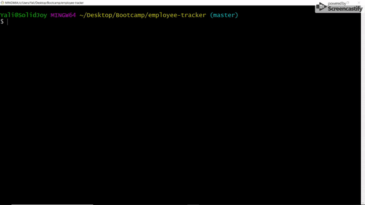

# Employee Tracker

A command line interface that makes it easy to access a company's employee database. 

## Getting Started

You can download this repository by clicking on the "Clone or download" button, then click on the "Download Zip" button. Then extract the files to your desired directory.

### Prerequisites

This interface runs on Node and uses the "inquirer", "console.table", and "mysql" packages.

To install node follow this [link](https://nodejs.org/en/download/).

To install the package dependencies, navigate to the "employee-tracker-master" directory in the command terminal, then type "npm install" and press ENTER. A "node_modules" folder should appear in the "employee-tracker-master" directory.

```
path/to/employee-tracker-master npm install
```
The databases are rendered using SQL. You can use [MySQL Workbench](https://www.mysql.com/downloads/) to handle the SQL files. The "schema.sql" and "seed.sql" found within the assets/sql directory can be used to create and populate the database.

## Deployment

To start the app, simply type "node employee-tracker.js" into the command terminal and press ENTER.

```
path/to/employee-tracker-master node employee-tracker.js
```
## Demo



## Built With
* [inquirer](https://www.npmjs.com/package/inquirer)
* [mysql](https://www.npmjs.com/package/mysql)
* [console.table](https://www.npmjs.com/package/console.table)
* [node.js](https://nodejs.org/en/)
* [Javascript](https://developer.mozilla.org/en-US/docs/Web/JavaScript)
* [Git](https://git-scm.com/)
* [GitHub](https://github.com/)
* [VSCode](https://code.visualstudio.com/)

## Author

**Yalí Miranda** 

* [Github](https://github.com/yjmiranda)
* [LinkedIn](https://www.linkedin.com/in/yal%C3%AD-miranda-8b4b94199/)
* [Portfolio](https://yjmiranda.github.io/portfolio/)